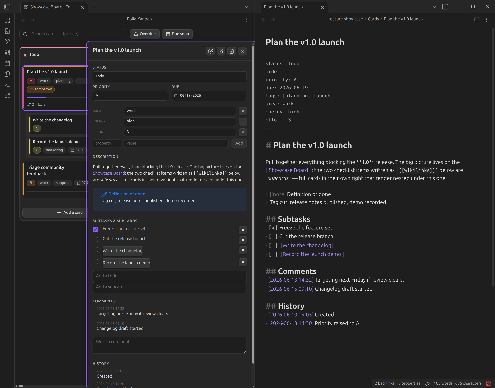

# Folia Kanban

**Kanban from plain Markdown.**

[](https://github.com/stavarengo/folia-kanban/releases)
[](https://obsidian.md)
[](https://github.com/stavarengo/folia-kanban/releases)
[](LICENSE)

> An interactive Kanban board for [Obsidian](https://obsidian.md) where **every card is a plain Markdown file** — drag-and-drop, nested subcards, comments, and history, with no database and no lock-in.


Columns, drag-and-drop, nested subcards, comments and an automatic history — backed entirely by plain `.md` files. Everything about a card (description, subtasks, subcards, comments, history) lives inside that one file as ordinary Obsidian-flavoured Markdown. No database, no proprietary blob, no weird syntax buried in your notes: your board *is* your notes.

## Contents

- [Your board is just Markdown](#your-board-is-just-markdown)
- [Features](#features)
- [Set up a board](#set-up-a-board)
- [Settings](#settings)
- [Keyboard & mouse](#keyboard--mouse)
- [Your data stays yours](#your-data-stays-yours)
- [Install](#install)
- [Develop](#develop)
- [Support](#support) · [Feedback](#feedback--issues) · [License](#license)

## Your board is just Markdown

There's no hidden state. Open any card in your editor and this is the whole thing:

```md
---
status: doing        # which column
order: 2.5           # position within the column (fractional)
priority: A
due: 2026-06-15
---

# Card title

Description text…

## Subtasks
- [ ] a plain todo
- [x] a done todo
- [ ] [[A Subcard]]      ← a nested child card (its own file)

## Comments
- [2026-06-13 14:32] looks good

## History
- [2026-06-13 14:30] Moved from Todo to Doing
```

Parentage has a single source of truth: a card is a subcard of P **iff** P's `## Subtasks` links to it. Body edits splice only the touched section; frontmatter is written via Obsidian's `processFrontMatter`, so unrelated bytes in your notes are never rewritten.

## Features

- **Drag-and-drop that persists** — by pointer or keyboard. Dropping a card writes its `status` and a fractional `order` (one card rewritten per move, never a mass reindex) and appends a `## History` line.
- **Quick actions on every card** — mark done, open the note, or delete (with confirm) straight from the board, or right-click for the full context menu (change priority, move up/down, add subcard, and more).
- **Next actions on the card** — optionally surface the next *N* unchecked todos inline, so the board shows the next step without opening anything.
- **Card detail panel** — present it as a docked side panel (split or floating) or a centred modal, your choice. It renders the description and comments with **Obsidian's own Markdown engine**, and lets you edit description, status, priority, due date and your **custom properties** (area, energy, …), manage subtasks/subcards, and add/edit/delete comments. Resizable, closes on click-outside, and never clips behind the status bar. Priority accepts any scale (`A`/`B`/`C`/`D` or `urgent`/`high`/`medium`/`low`).
- **Subcards grouped Jira-style** — `- [ ] [[Child]]` is a full child card; children render nested in a bordered group under their parent, in the parent's column.
- **Configurable** — a real settings tab: detail presentation, add-card flow, how many next-todos to show, and what History records (see [Settings](#settings)).
- **Search & quick filters** — press `/` to search by title, tag or priority; one-click **Overdue** / **Due soon** filters.
- **Soft WIP limits** — set a per-column limit; the board nudges (never blocks) when you go over.
- **In-app column management** — add, rename, recolour, set limits, reorder and delete columns; changes are written back to the board note's `columns` frontmatter.
- **Relative due dates** — *Today*, *Tomorrow*, *in 3d*, *Yesterday*, with overdue cards flagged.
- **Comments** and auto-generated **history**, appended to the card file with timestamps.
- **Live reload** when files change outside the board, with a self-write echo guard.
- **Accessible & themed** — keyboard-navigable, ARIA roles and focus management throughout; styled with Obsidian's own CSS variables (light + dark) for a clean, shadcn-grade look.



## Set up a board

1. Make a **board note** — any note with this frontmatter (see `examples/basic/` for a minimal board, or `examples/feature-showcase/` for one that exercises every feature):

   ```yaml
   folia-board: true
   card-folder: Cards      # folder holding the card notes
   columns:
     - todo
     - doing
     - done
   ```

2. Put card notes (each with a `status` matching a column) in that folder.
3. Run the command **“Open Folia Kanban board”** or click the layout-grid ribbon icon.

Columns can be edited by hand in the board note's `columns` property, or managed in-app from each
column's `⋯` menu (rename, recolour, WIP limit, reorder, delete) and the **Add column** button — the
plugin reads and writes that frontmatter list either way. A column entry may be a plain string
(`- todo`) or an object (`{ id, title, color, limit }`).

## Settings

Under **Settings → Folia Kanban** (changes apply live, no reload):

- **Card details — presentation** — `side` (docked beside the board) or `modal` (centred dialog).
- **Side panel — layout** — `split` (shrinks the columns to the left) or `float` (overlays the columns); used when presentation is `side`.
- **Side panel — width** — the docked panel's width; you can also drag its left border.
- **Add-card button — flow** — `inline` (add in the column), `inline-edit` (add, then open the new card's details), or `detail` (open a details form to create).
- **Add-card — open new card's details as** — which presentation to use for the two detail-opening add flows.
- **Card — next todos shown** — how many upcoming unchecked todos to surface on each card (0 = none).
- **History — what to record** — `moves` (card moves/reorders only), `structural` (also priority/status/due/order changes), or `all` (also comments and subtasks).

## Keyboard & mouse

| Action | How |
| --- | --- |
| Search by title, tag or priority | Press `/` |
| Filter overdue / due-soon cards | One-click **Overdue** / **Due soon** buttons |
| Move or reorder a card | Drag with the pointer, or pick it up with the keyboard |
| Scroll horizontally across columns | Hold **Shift** and drag the board background |
| Card menu (open, mark done, priority, move up/down, add subcard, delete) | Right-click a card |
| Toggle or remove a surfaced todo | Right-click the todo |
| Column menu (rename, recolour, WIP limit, reorder, delete) | The column's `⋯` button |

## Your data stays yours

Folia Kanban runs entirely on the files in your vault. There is **no database, no account, no sync service, and no telemetry** — the plugin makes no network requests at all. Every card is a `.md` file you can read, edit, grep, version-control, or open in any other editor. Switch to a different app tomorrow and your board comes with you, because it was never anything but Markdown.

Edits are surgical: body changes splice only the section they touch, and frontmatter is written through Obsidian's `processFrontMatter`, so unrelated bytes are never rewritten. A byte-stability round-trip over the fixtures in `test/fixtures/` proves it.

## Install

**Requirements:** Obsidian **1.7.0+**. Runs on desktop and mobile.

### From Community Plugins

> *Coming soon — Folia Kanban is awaiting review for the Obsidian community store. Until it's listed, use the manual install below.*

1. Open **Settings → Community plugins** and turn off restricted mode.
2. Click **Browse**, search for **Folia Kanban**, and install it.
3. Enable it under **Settings → Community plugins**.

### Manual

Download a release from the [Releases page](https://github.com/stavarengo/folia-kanban/releases) (or build it yourself — see [Develop](#develop); the bundle lands in `dist/`), then copy `main.js`, `manifest.json` and `styles.css` into `<your-vault>/.obsidian/plugins/folia-kanban/` and enable it under **Settings → Community plugins**.

## Develop

```bash
pnpm install
pnpm build       # production bundle -> dist/ (main.js, manifest.json, styles.css)
pnpm dev         # watch build
pnpm test        # vitest: model, board graph, drag, and UI flows
pnpm typecheck   # tsc --noEmit
```

The pure model (`src/model`), board graph + drag reducer, and UI logic are unit-tested, including a byte-stability round-trip over the fixtures in `test/fixtures/` that proves edits never corrupt untouched bytes of a card file. The `dist/` build output, `node_modules` and the pnpm store are git-ignored; releases ship the built `dist/main.js`.

## Support

If Folia Kanban makes your week a little easier, a ⭐ on [GitHub](https://github.com/stavarengo/folia-kanban) genuinely helps other people find it.

## Feedback & issues

Found a bug or have an idea? Open an issue on [GitHub Issues](https://github.com/stavarengo/folia-kanban/issues).

## License

[AGPL-3.0](LICENSE) © Rafael Stavarengo
